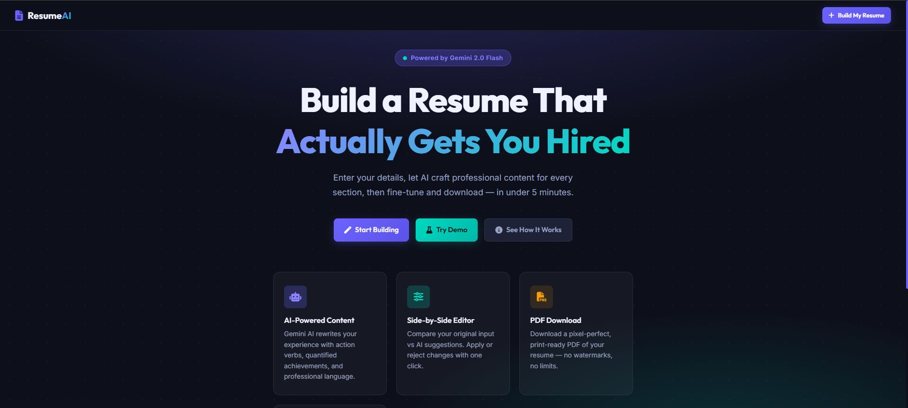
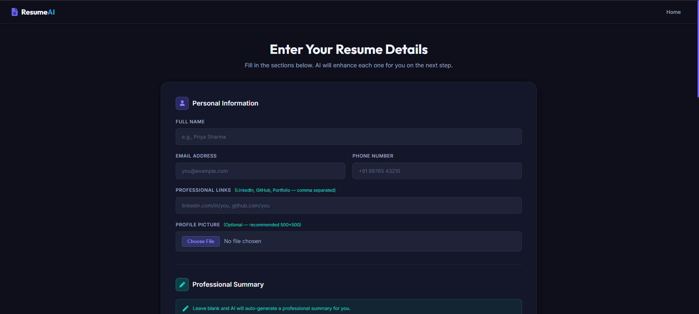
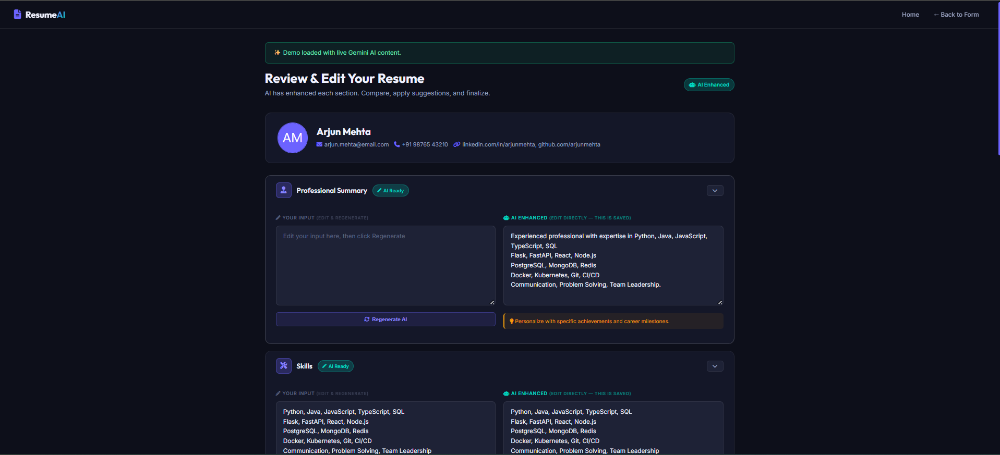
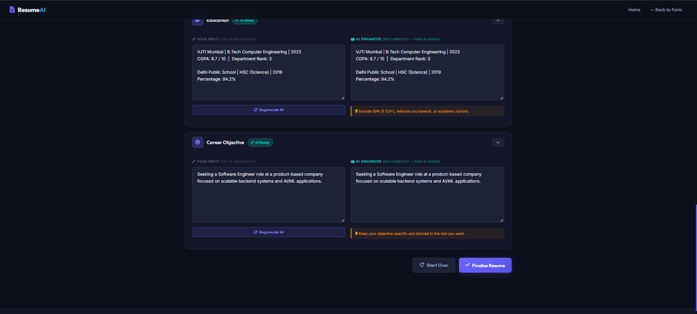
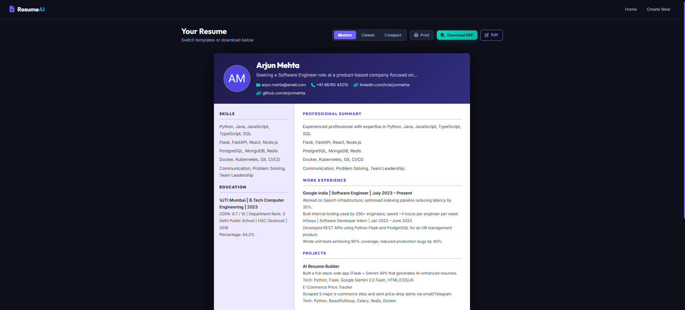

# 🤖 AI Resume Builder

An AI-powered Resume Builder built with Flask and Google Gemini that helps users create professional, ATS-friendly resumes from simple inputs.

The application enhances user-provided information using Google's Gemini AI, allows users to review and edit the generated content, and exports the final resume as a professionally formatted PDF.

---

## ✨ Features

- AI-generated professional resume content using Google Gemini
- ATS-friendly resume formatting
- Professional Summary generation
- Skills enhancement and categorization
- Experience improvement with action-oriented bullet points
- Education formatting
- Career Objective generation
- Profile picture upload
- Live preview before finalizing
- Download resume as PDF
- Responsive user interface
- Environment-based configuration

---

## 🛠 Tech Stack

### Backend
- Python
- Flask

### AI
- Google Gemini API

### Frontend
- HTML
- CSS
- JavaScript
- Jinja2 Templates

### PDF Generation
- WeasyPrint

### Configuration
- python-dotenv

---

## 📁 Project Structure

```
AI-Resume-Builder/
│
├── app.py
├── requirements.txt
├── .env.example
├── README.md
│
├── static/
│   ├── css/
│   ├── js/
│   ├── uploads/
│   └── images/
│
├── templates/
│
└── temp_data/
```

---

## ⚙️ Installation

Clone the repository

```bash
git clone https://github.com/YOUR_USERNAME/AI-Resume-Builder.git

cd AI-Resume-Builder
```

Create a virtual environment

```bash
python -m venv venv
```

Activate it

Windows

```bash
venv\Scripts\activate
```

Linux / macOS

```bash
source venv/bin/activate
```

Install dependencies

```bash
pip install -r requirements.txt
```

Create a `.env` file

```env
GEMINI_API_KEY=your_api_key
GEMINI_MODEL=gemini-2.5-flash
SECRET_KEY=your_secret_key
```

Run the application

```bash
python app.py
```

Open

```
http://127.0.0.1:5000
```

---

## 🚀 How It Works

1. Enter personal and professional details.
2. Upload a profile picture (optional).
3. Gemini AI enhances the resume content.
4. Review and edit generated sections.
5. Generate a professionally formatted PDF.
6. Download the final resume.

---

## 📸 Screenshots


### Home Page


### Resume Form


### AI Generated Content


### Resume Preview


### Final Resume Preview


---

## 🔮 Future Improvements

- Docker support
- CI/CD with GitHub Actions
- Multiple resume templates
- User authentication
- Database integration
- Cloud deployment
- Resume version history

---

## 📄 License

This project is licensed under the MIT License.